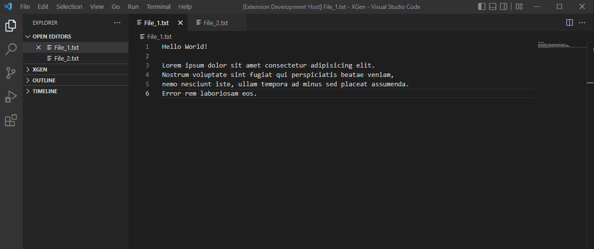

# ⚡ FAST COMPARE ⚡

Enables fast way of comparing two files via Context Menu Action on Text Editor Title and swapping between compared files.

*************************************

## Release Notes

### 1.1.1
Restricted mode compatibility added! Now you can use the extension while in restricted mode.

### 1.1.0
Swap feature added! You can now easily swap the files you are comparing. Command is assignable to a key shortcut.

### 1.0.4

Fixed a bug with some files not being found.

### 1.0.3

Minor fixes.

### 1.0.2

Extension now has an icon!

### 1.0.1

Extension now supports in-memory files (not saved).

### 1.0.0

Initial release of Fast Compare.
